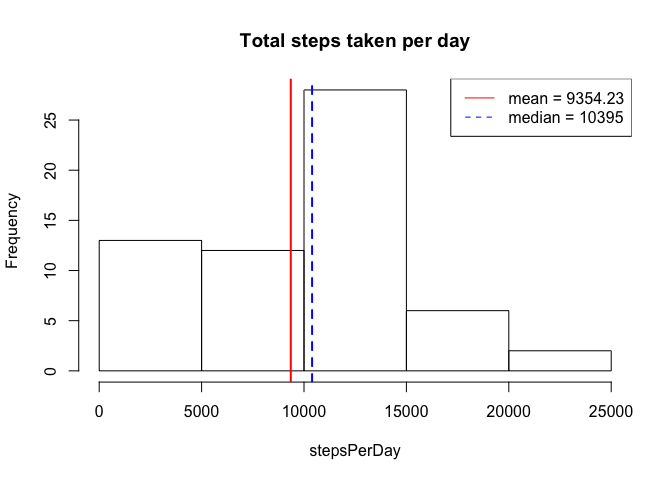
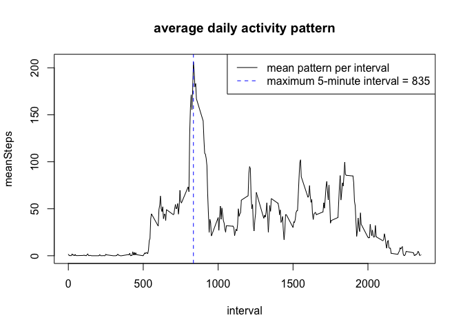
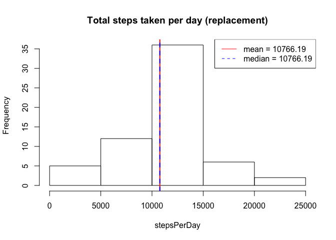

#  Activity Monitoring - Reproducible research project 
Michalis Frangos  

## Data description 
This assignment makes use of data from a personal activity monitoring device. 
This device collects data at 5 minute intervals through out the day. The data 
consists of two months of data from an anonymous individual collected during 
the months of October and November, 2012 and include the number of steps taken 
in 5 minute intervals each day.

The variables included in this dataset are:
* steps: Number of steps taking in a 5-minute interval (missing values as 𝙽𝙰)
* date: The date on which the measurement was taken in YYYY-MM-DD format
* interval: Identifier for the 5-minute interval in which measurement was taken

The dataset is stored in a comma-separated-value (CSV) file and there are a 
total of 17,568 observations in this dataset.

Data can be found [here][1]
[1]: https://d396qusza40orc.cloudfront.net/repdata%2Fdata%2Factivity.zip  "here"

## Downloading and unzipping dataset

```r
fileName <- "activity.csv"
fileUrl <- "https://d396qusza40orc.cloudfront.net/repdata%2Fdata%2Factivity.zip"

if (!file.exists("downloads") & !file.exists(fileName)){
        message("- downloading data")
        dir.create("downloads")
        download.file(fileUrl,destfile = "./downloads/project_data.zip",method = "auto") 
        dateDownloaded <- date()
        message("- data downloaded")
} else {
        message("- data already downloaded")  
}
```

```
## - data already downloaded
```

```r
if  (!file.exists(fileName)){
        message("- unzipping data")
        unzip("./downloads/project_data.zip")
        message("- data unzipped")
} else {
        message("- data file exists")      
}
```

```
## - data file exists
```

## Reading in and processing data

```r
# read csv file
data <- read.csv(fileName,na.strings = "NA")
# Convert the Date variable to date class in R
data$date <- as.Date(data$date,"%Y-%m-%d") 
# # have a look at data
head(data)
```

```
##   steps       date interval
## 1    NA 2012-10-01        0
## 2    NA 2012-10-01        5
## 3    NA 2012-10-01       10
## 4    NA 2012-10-01       15
## 5    NA 2012-10-01       20
## 6    NA 2012-10-01       25
```

# What is the mean total number of steps taken per day?


```r
library(dplyr)
library(lattice)
# group by date and sum steps by date
dataMutated <- group_by(data,date) %>%
        summarize(stepsPerDay = sum(steps,na.rm= TRUE))

# compute mean and median 
mean_stepsPerDay = mean(dataMutated$stepsPerDay, na.rm = TRUE)
median_stepsPerDay = median(dataMutated$stepsPerDay, na.rm = TRUE)
# create figure
text_legend1 <- paste("mean",round(mean_stepsPerDay,digits=2),sep = " = ")
text_legend2 <- paste("median",round(median_stepsPerDay,digits=2),sep = " = ")
with(dataMutated,{ hist(stepsPerDay,
                        main = "Total steps taken per day",breaks = 5)
        abline(v = mean_stepsPerDay,col = "red",lwd = 2)
        abline(v = median_stepsPerDay,col = "blue",lwd = 2,lty=2)
        legend("topright",lty=c(1,2),col=c("red","blue"),
               legend=c(text_legend1,text_legend2) ) })
```



# What is the average daily activity pattern?

```r
library(ggplot2)
# group by interval and compute means of intervals
dataMutated <- group_by(data,interval) %>%
        summarize(meanSteps = mean(steps,na.rm= TRUE))

# find maximum interval and steps
max_index <- which.max(dataMutated$meanSteps)
max_interval <- dataMutated$interval[max_index]
max_steps <- dataMutated$meanSteps[max_index]
# create figure
text_legend1 <-"mean pattern per interval"
text_legend2 <- paste("maximum 5-minute interval",max_interval,sep = " = ")
with(dataMutated,{ plot(interval,meanSteps,
                        main = "average daily activity pattern",type = "l")
        abline(v = max_interval,col = "blue",lwd = 1,lty = 2)
        legend("topright",lty=c(1,2),col=c("black","blue"),
               legend=c(text_legend1,text_legend2)) 
})
```



# Imputing missing values

- The number of missing values in data is: 


```r
# find complete cases
ok <- complete.cases(data)
print(paste(sum(!ok)))
```

```
## [1] "2304"
```

- Filling missing values in the dataset by replacing with mean of interval


```r
library(ggplot2)
# group by niterval and compute means
df <- group_by(data,interval) %>%
        summarize(meanSteps = mean(steps,na.rm= TRUE))
df <- merge(df,data)                 # merge data and new df
ok <- complete.cases(df)             # find which entries to replace
df$steps[!ok] <- df$meanSteps[!ok]   # replace with mean of interval
df <- subset(df, select = names(data))%>%
        arrange((date))          # order by date as in original data
```

- What is mean total number of steps taken per day?


```r
dataMutated <- group_by(df,date) %>%
        summarize(stepsPerDay = sum(steps,na.rm= TRUE))
mean_stepsPerDay = mean(dataMutated$stepsPerDay, na.rm = TRUE)
median_stepsPerDay = median(dataMutated$stepsPerDay, na.rm = TRUE)
text_legend1 <- paste("mean",round(mean_stepsPerDay,digits=2),sep = " = ")
text_legend2 <- paste("median",round(median_stepsPerDay,digits=2),sep = " = ")
with(dataMutated,{ hist(stepsPerDay,
                        main = "Total steps taken per day (replacement)",
                        breaks = 5)
        abline(v = mean_stepsPerDay,col = "red",lwd = 2)
        abline(v = median_stepsPerDay,col = "blue",lwd = 2,lty=2)
        legend("topright",lty=c(1,2),col=c("red","blue"),
               legend=c(text_legend1,text_legend2) ) })
```



### Total number of steps taken per day (replacement VS ignoring NA's)

The strategy  followed  to replace the missing values, is to place them with the 
corresponding mean of their interval, as computed from the available data.
In the previous example the missing values were ignored, and a large number of
days ended up with sum of steps equal to zero. In this case  the missing values
were replaced by the mean of their corresponding interval,the number of days 
with zero steps per day are less than before. As a result the mean and median
are now the same, and the distribution is similar to a Normal distibution.

## Are there differences in activity patterns between weekdays and weekends?

Create a new factor variable in the dataset with two levels – “weekday” and 
“weekend” indicating whether a given date is a weekday or weekend day.


```r
days <- df$dates
days[weekdays(df$date) %in% c("Saturday","Sunday")] <- "weekend"
days[!(weekdays(df$date) %in% c("Saturday","Sunday"))] <- "weekday"
weektime <- factor(days,levels = c("weekend","weekday"))
df$weektime <- weektime
```

Make a panel plot containing a time series plot (i.e. 𝚝𝚢𝚙𝚎 = "𝚕") of the 5-m
inute interval (x-axis) and the average number of steps taken, averaged across 
all weekday days or weekend days (y-axis). See the README file in the GitHub 
repository to see an example of what this plot should look like using simulated 
data.


```r
df_aggr <- aggregate(df$steps, 
                     list(interval = df$interval,weektime=df$weektime),mean)
names(df_aggr)[names(df_aggr) == 'x']  <- "steps"
with(df_aggr,{xyplot(steps~interval| weektime, layout = c(1,2),
                     main="Average Steps per Day",type="l")
})
```


